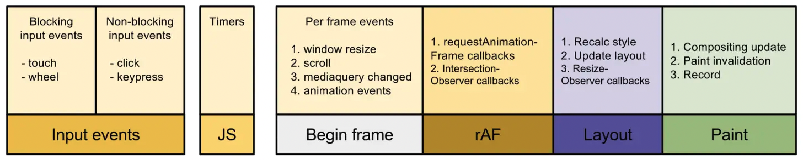
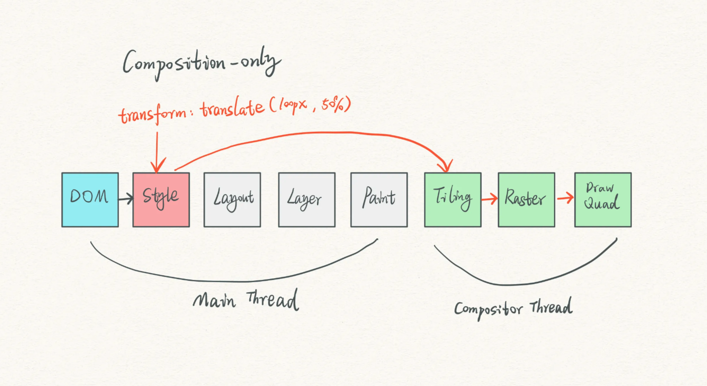

# [Browser] Frame

## FPS and lag

Human eyes can see up to **1,000 frames per second (FPS)**.

In slow or static scenes, we **rarely tell the difference beyond 30 FPS**.

However, it becomes noticeable in dynamic scenes, such as playing first-person shooter video games.

Today, most monitors refresh rate is **60 FPS or 60 Hertz**.

Ideally, the browser needs to complete the **rendering stage and deliver a frame within 1/60 seconds**.

That is **16.67 milliseconds**. If so, a user sees a smooth animation and **doesn’t feel lagging**.

In the interaction stage, usually, a page update is triggered by executing JavaScript.

Most of the time, it could trigger reflow and repaint.

## Life of a Frame

A life of a frame will be as below in general.

### requestIdleCallback

If browser has idle time at the end of a frame in main thread, it would fire **requestIdleCallback**.

###  More detail about render process

### Avoid trigger reflow and repaint

A typical CSS animation uses a **“transform”** property.

Modifying “transform” value skips the layout, layer, and paint phases, and starts with the tilling in the **compositor thread**.

## Reference

+ @ [Carson](https://cabulous.medium.com/how-does-browser-work-in-2019-part-5-optimization-in-the-interaction-stage-66b53b8ec0ad) - How does browser work step by step [latest] — optimization in the interaction stage (part 5)
+ @ [簡書](https://www.jianshu.com/p/2771cb695c81) - requestIdleCallback和requestAnimationFrame详解
+ @ [aerotwist](https://aerotwist.com/blog/the-anatomy-of-a-frame/) - The Anatomy of a Frame
+ @ [知乎](https://zhuanlan.zhihu.com/p/39878259) - 网页渲染性能优化 —— 性能优化上
+ @ [qinguanghui](https://www.qinguanghui.com/react/%E6%B5%8F%E8%A7%88%E5%99%A8%E4%B8%80%E5%B8%A7%E9%87%8C%E5%81%9A%E4%BA%86%E4%BB%80%E4%B9%88) - 浏览器一帧里做了什么？
