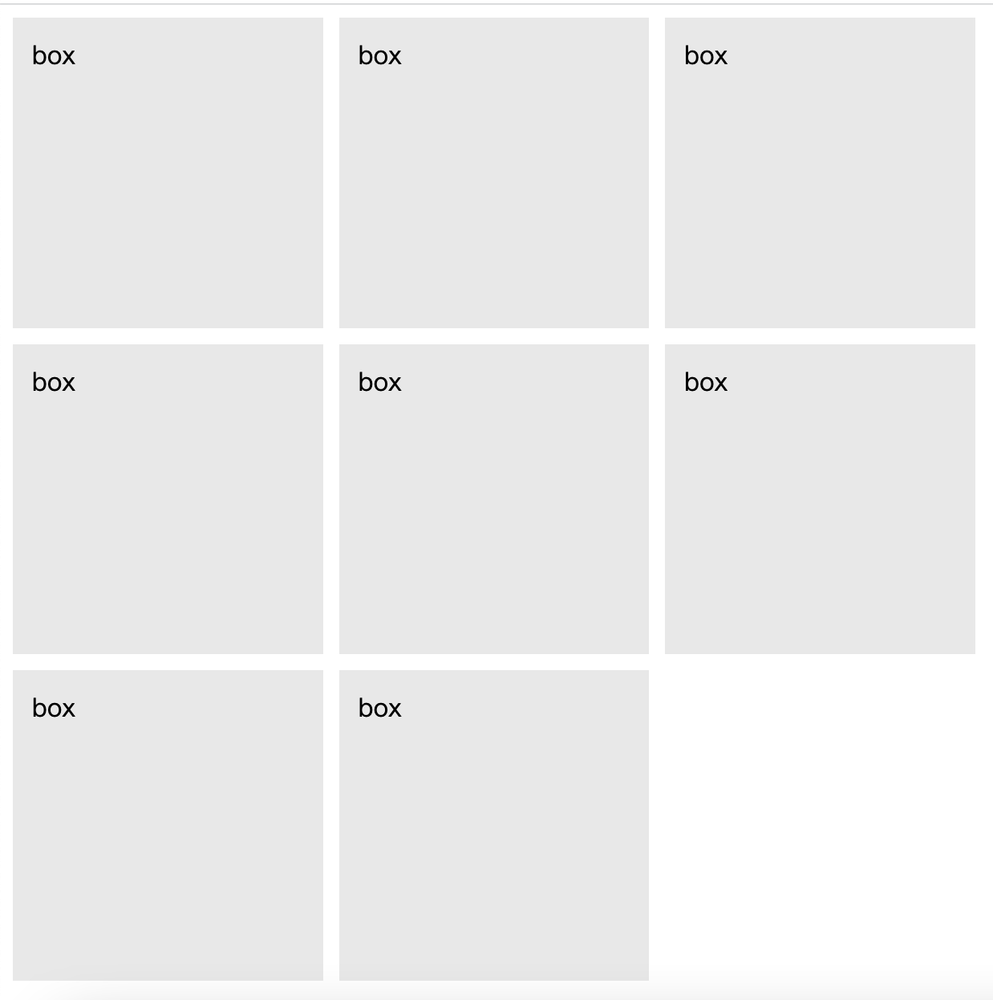

# [CSS] grid

## Intro

CSS Grid (or just Grid) is essentially a two-dimensional website layout system that is used to structure the elements on a web page.

## Example: Instagram example

```css
.layout {
    display: grid;
    grid-template-columns: 1fr 1fr 1fr;
    grid-gap: 10px;
}

.box {
    padding: 12px;
    background-color: #e8e8e8;
    aspect-ratio: 1;
}
```

```html
<div class="layout">
    <div class="box">box</div>
    <div class="box">box</div>
    <div class="box">box</div>
    <div class="box">box</div>
    <div class="box">box</div>
    <div class="box">box</div>
    <div class="box">box</div>
    <div class="box">box</div>
</div>
```



## Reference

+ @[makeuseof](https://www.makeuseof.com/learn-how-to-build-two-dimensional-websites-with-css-grid/)
