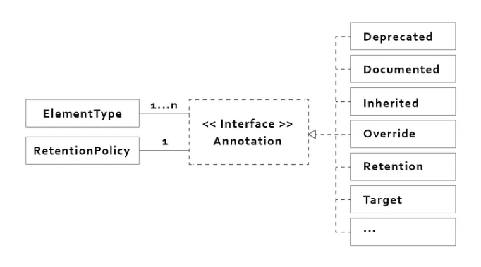

# [Kotlin] Annotation

> + @[wangkuiwu](http://wangkuiwu.github.io/2012/03/03/annotation/) - Annotation
> + @[YuAn](https://medium.com/@corrupt003/java-kotlin-android-annotation-67f78b820ce4) - Java/Kotlin/Android Annotation 
> + @[developer.android.com](https://developer.android.com/reference/kotlin/java/lang/annotation/RetentionPolicy)

:::caution

This is not original content, but just a note from articles I read.

:::

## Annotation's architecture in JAVA



From the image, we can know:
+ Each **Annotation** has **only one RetentionPolicy**.
+ Each **Annotation** can be associated with **many ElementType**.

## RetentionPolicy

``` 
class RetentionPolicy
```

The constants of this enumerated class describe the various policies for retaining annotations.

They are used in conjunction with the Retention meta-annotation interface to specify **how long annotations are to be retained**.

#### Enum values
+ **CLASS** - Annotations are to be recorded in the class file by the compiler but need not be retained by the VM at run time.
+ **RUNTIME** - Annotations are to be recorded in the class file by the compiler and retained by the VM at run time, so they may be read reflectively.
+ **SOURCE** - Annotations are to be discarded by the compiler.

#### Kotlin (with AnnotationRetention enum)
```
@Target(AnnotationTarget.FUNCTION)
@Retention(AnnotationRetention.RUNTIME)
annotation class Prometheus(
    val name: String
)
```

:::info

In Java Language Specification **[section 9.6.4.2.](https://docs.oracle.com/javase/specs/jls/se11/html/jls-9.html#jls-9.6.4.2)**:

If T does not have a (meta-)annotation m that corresponds to java.lang.annotation.Retention, then a Java compiler must treat T as if it does have such a meta-annotation m with an element whose value is **java.lang.annotation.RetentionPolicy.CLASS**.
:::

## ElementType

```
class ElementType
```

The constants of this enumerated class provide a simple classification of the syntactic locations where annotations may appear in a Java program.

These constants are used in **Target meta-annotations** to specify where it is legal to write annotations of a given type.

> [read more detail about ElementType](https://developer.android.com/reference/kotlin/java/lang/annotation/ElementType)

> [read more detail about AnnotationTarget](https://kotlinlang.org/api/latest/jvm/stdlib/kotlin.annotation/-annotation-target/)

#### Kotlin (with AnnotationTarget enum)
```
@Target(AnnotationTarget.FUNCTION)
@Retention(AnnotationRetention.RUNTIME)
annotation class Prometheus(
    val name: String
)
```

## Reference

+ @[wangkuiwu](http://wangkuiwu.github.io/2012/03/03/annotation/) - Annotation
+ @[YuAn](https://medium.com/@corrupt003/java-kotlin-android-annotation-67f78b820ce4) - Java/Kotlin/Android Annotation
+ @[developer.android.com](https://developer.android.com/reference/kotlin/java/lang/annotation/RetentionPolicy)
