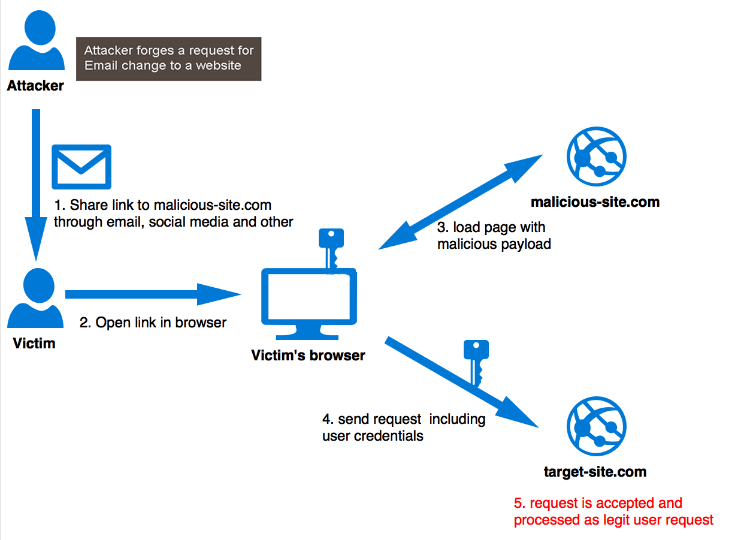

# [net] CSRF

:::caution

This is not original content, but just a note from articles I read.

:::

## What is CSRF?

Cross site request forgery or CSRF is a type of attack that occurs when a malicious web site, email, blog, instant message, or program causes a user's web browser **to perform an unwanted action on an other trusted site** where the user is authenticated.

## Reference

+ @ [dev.to](https://dev.to/maleta/cors-xss-and-csrf-with-examples-in-10-minutes-35k3)
