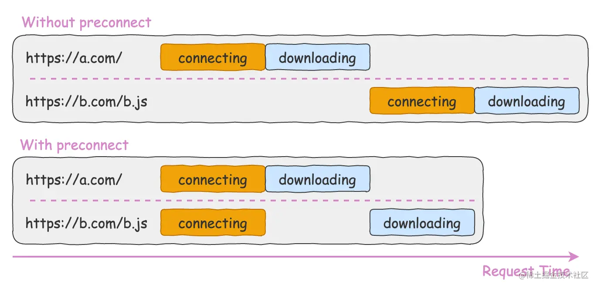

# [net] preconnect

## Intro

The preconnect keyword for the rel attribute of the rel element is a hint to browsers that the user is likely to need resources from the target resource's origin, and therefore the browser can likely improve the user experience by preemptively initiating a connection to that origin.

## What does it do?

Preconnecting speeds up future loads from a given origin by preemptively performing part or all of the handshake (DNS+TCP for HTTP, and DNS+TCP+TLS for HTTPS origins).

## Comparsion

## preconnect vs dns-prefetch

dns-prefetch = DNS and preconnect = DNS + TCP + TLS. Note that DNS lookup is quite cheap to perform (a simple query-response to the DNS server, that is cached in the browser for a short amount of time), whereas TCP and TLS involves some server resources.

The practical difference is hence, if you know that a server fetch will happen for sure, preconnect is good. If it will happen only sometimes, and you expect huge traffic, preconnect might trigger a lot of useless TCP and TLS work, and dns-prefetch might be a better fit.

### For example:

+ if the page requests https://backend.example.com/giveMeFreshData on each load, and the response is not cacheable, preconnect is a good fit.
+ if the page only requests a static resource like https://statics-server.example.com/some-image.jpg or https://statics-server.example.com/some-css.css, and the resource is very likely to come from the user's browser cache (the very same resource(s) is used on many pages, and your user will trigger a lot of page loads like this with the warm cache -- and no other resources are fetched from that origin), then preconnect might be creating a lot of unnecessary TCP connections on your server (that will abandoned after a few seconds, but still, they were not necessary in the first place) and TLS handshakes (however in such case, preload might be an option if you know the exact URL and the resource is very important).

+ If the traffic on your website is small though, it should not be impacted too much by this difference, so preconnect is probably a good fit for low-traffic websites, regardless of the things mentioned before.

## Reference

+ @ [MDN](https://developer.mozilla.org/en-US/docs/Web/HTML/Attributes/rel/preconnect) - preconnect

+ @ [juejin](https://juejin.cn/post/6915204591730556935#heading-0) - preload、prefetch、preconnect 和 dns-prefetch 知多少

+ @[stackoverflow](https://stackoverflow.com/questions/47273743/preconnect-vs-dns-prefetch-resource-hints) - preconnect vs dns-prefetch resource hints
