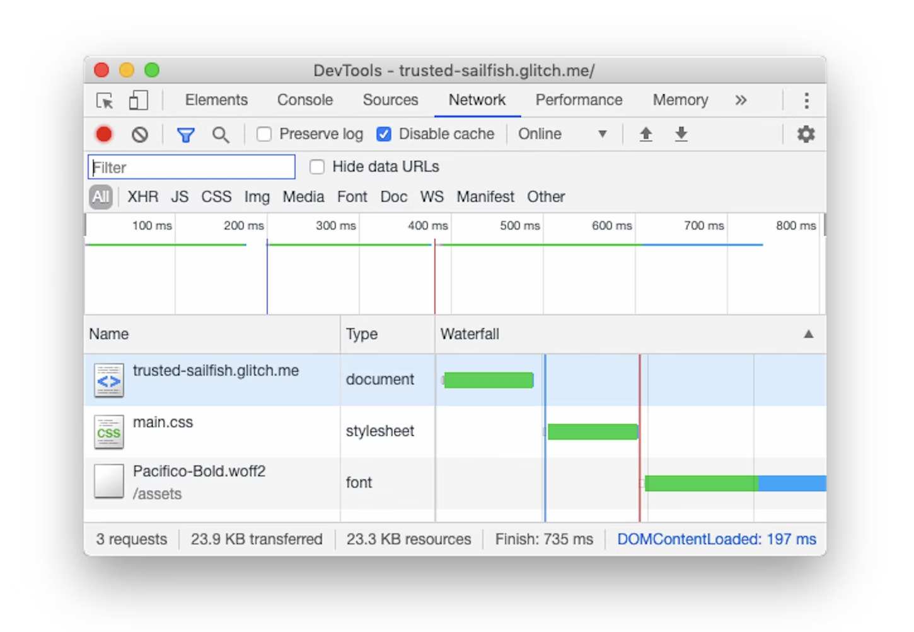

# [net] prefetch

## What is prefetch?

The prefetch keyword for the rel attribute of the <link\> element is a hint to browsers that the user is likely to need the target resource for future navigations, and therefore the browser can likely improve the user experience by **preemptively fetching** and **caching the resource**.

:::info

Both **preload** and **prefetched** resources are stored in the **HTTP cache**.

:::

#### Example
```html
<link rel="prefetch" as="script" href="https://cdn.bootcss.com/jquery/2.1.4/jquery.min.js">
```




## Reference

+ @ [MDN](https://developer.mozilla.org/en-US/docs/Web/HTML/Attributes/rel/prefetch) - prefetch
