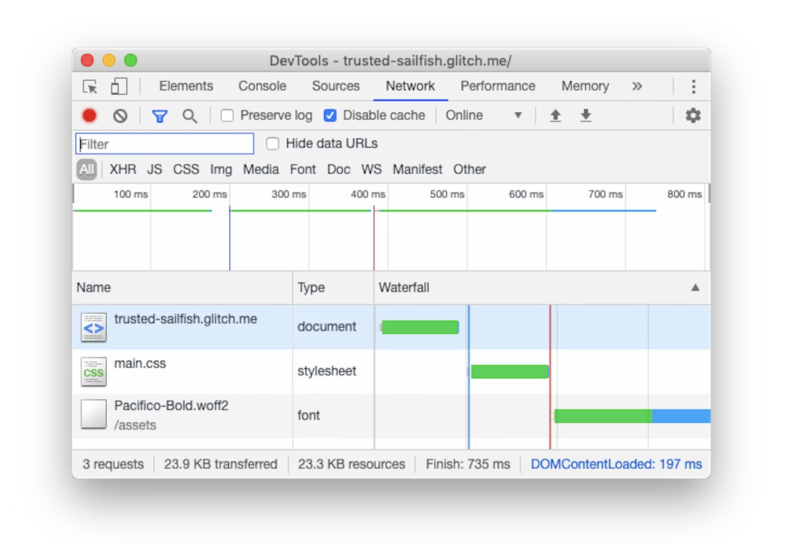
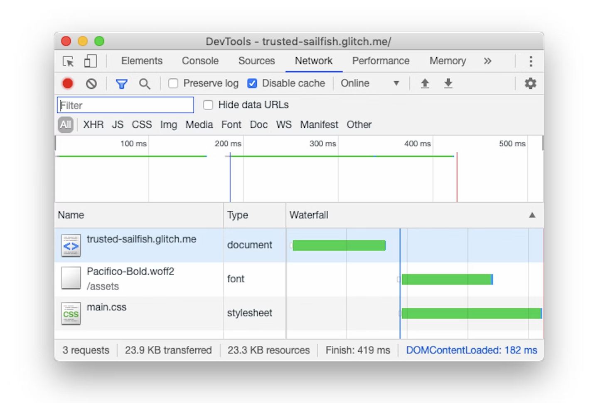

# [net] preload

## What is preload?

The preload value of the <link\> element's rel attribute lets you declare fetch requests in the **HTML's <head\>**, specifying resources that your page will **need very soon**, which you want to start loading early in the page lifecycle, **before browsers' main rendering machinery kicks in**.

This ensures they are **available earlier** and are **less likely to block the page's render**, improving performance.

#### Example: preload font

## Reference

+ @ [MDN](https://developer.mozilla.org/en-US/docs/Web/HTML/Attributes/rel/preload) - preload
+ @ [web.dev](https://web.dev/i18n/en/preload-critical-assets/)
