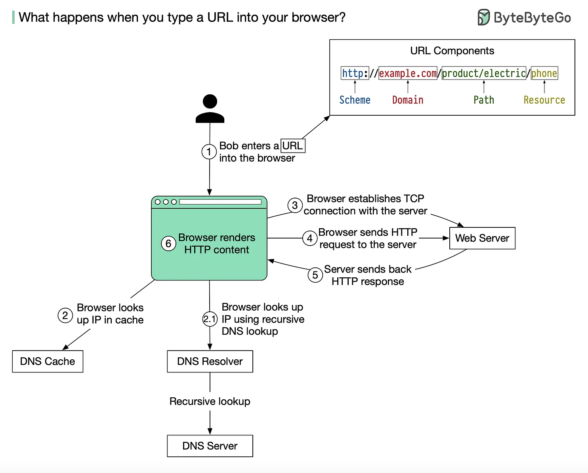

# [net] What happens when you type a URL in your web browser ?

1. You enter a website's URL in your web browser and press enter.
2. Your web browser sends a request to the **domain name system (DNS)** to **translate the domain name** in the URL to an **IP address**.
3. The **DNS responds with the IP address** of the web server hosting the website.
4. Your web browser **establishes a connection** with the web server using the **Transmission Control Protocol (TCP)**.
5. Your web browser **sends a request to the web server** for the website's HTML file.
6. The web **server receives the request** and **sends the HTML file back** to your web browser.
7. Your web browser **parses the HTML file** and **sends additional requests** for any other assets needed to display the website, such as **images**, **CSS files**, and **JavaScript files**.
8. The web server sends each requested asset back to your web browser.
9. Your web browser renders the website, combining all the assets it has received into the final website displayed on your screen.

> Image from [Alex Xu](https://blog.bytebytego.com/p/what-happens-when-you-type-a-url) 

