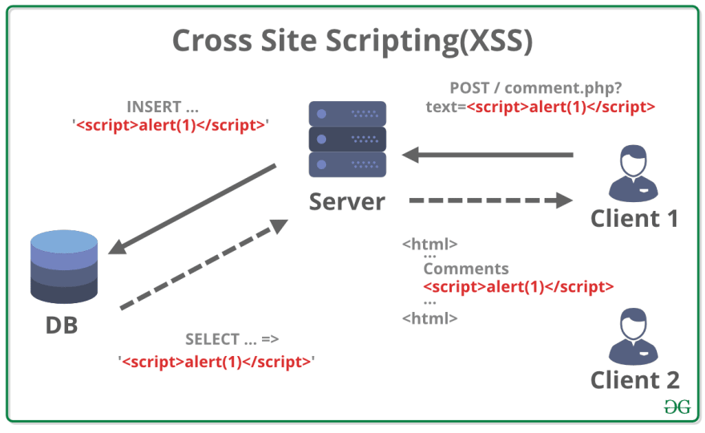
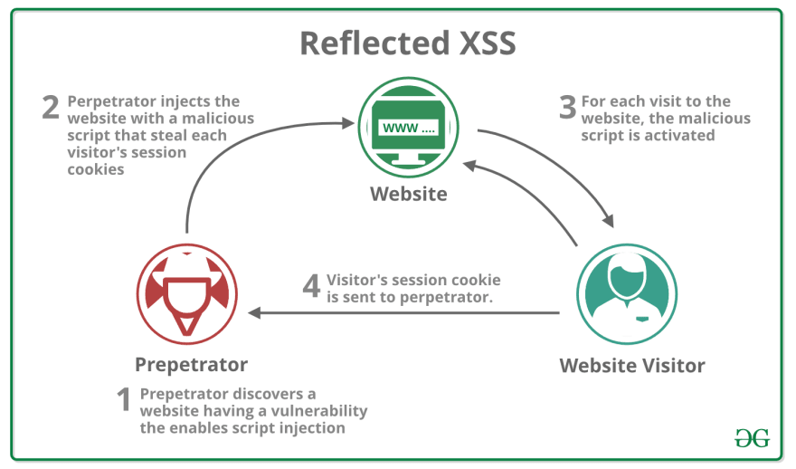

# [net] XSS

:::caution

This is not original content, but just a note from articles I read.

:::

## What is XSS?

XSS stands for Cross Site Scripting and it is injection type of attack.

Cross site scripting is the method where the attacker injects malicious script into trusted website.

There are 3 types of such attacks.

### Stored XSS

Vulnerability coming from unprotected and not sanitized user inputs those are directly stored in database and displayed to other users.

### Reflected XSS
Reflected XSS is attack that happens when attacker discovers page with such vulnerability, for example:

#### expected URL: https://mywebpage.com/search?q=javascript

#### malicious URL: https://mywebpage.com/search?q=

### DOM based XSS

This kind of attack is same as reflected but with difference that malicious URL part will not be sent to server at all. For above example:

#### expected URL: https://mywebpage.com/search?q=javascript

#### malicious URL(reflected XSS): https://mywebpage.com/search?q=

#### malicious URL(DOM based XSS): https://mywebpage.com/search#q=

Difference is in the character # being used instead of ?.

The browsers **do not send part of URL after # to server**, so they pass it directly to your client code.

## Reference

+ @ [dev.to](https://dev.to/maleta/cors-xss-and-csrf-with-examples-in-10-minutes-35k3)
