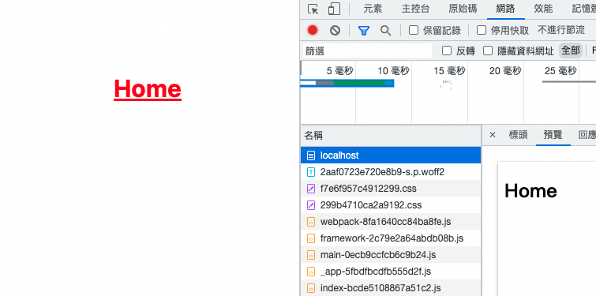

# [NextJs] Render css on server side

## Tutorial

:::tip
support [tailwindcss](https://tailwindcss.com/) and css modules
:::

step 1.enable optimizeCss

```javascript title=next.config.js
/** @type {import('next').NextConfig} */
const nextConfig = {
  reactStrictMode: true,
  experimental: {
    optimizeCss: true, // enabling this will enable SSR for Tailwind
  },
}

module.exports = nextConfig
```

step 2. run `yarn add -D critters`

> Next.JS will internally use this library called Critters.

step 3. then run `yarn build` and `yarn start`

#### Before




#### After


