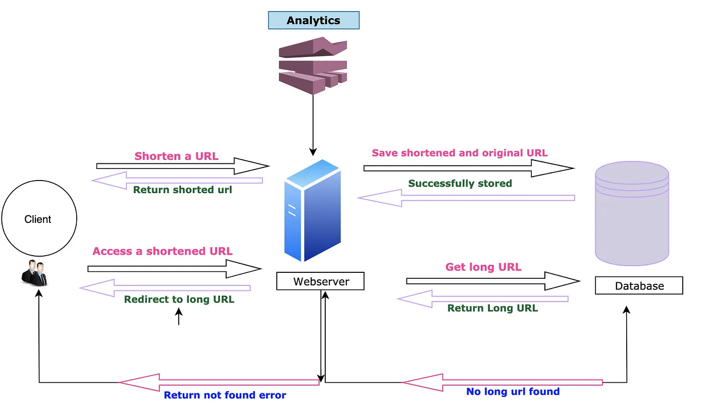
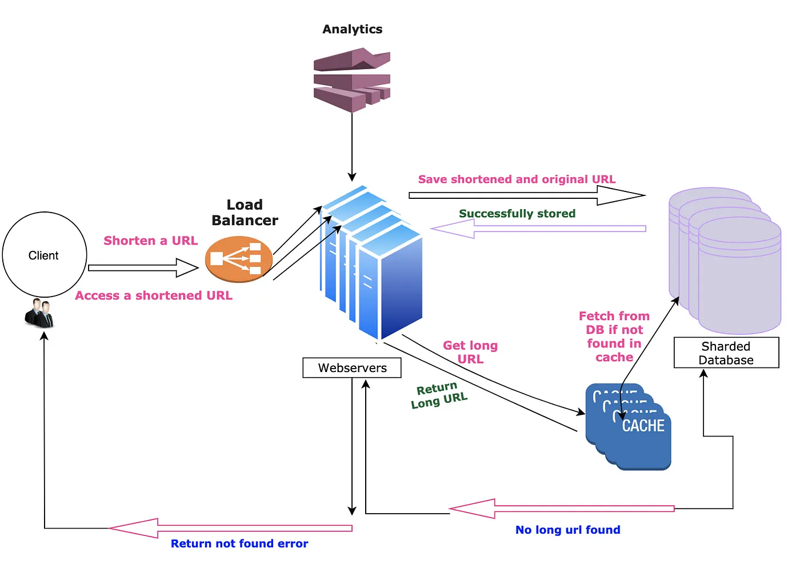

# [System Design] URL Shortener Service

## What is URL Shortener Service?

A **URL shortener service** creates a short url/aliases/tiny url against a long url.

### Rudimentary Design

-> [My rudimentary demo](https://github.com/Ruila/url-shortener-backend)

### Scalable High Level Design

## Reference

+ @ [Sandeep Verma](https://medium.com/@sandeep4.verma/system-design-scalable-url-shortener-service-like-tinyurl-106f30f23a82) - System Design : Scalable URL shortener service like TinyURL
