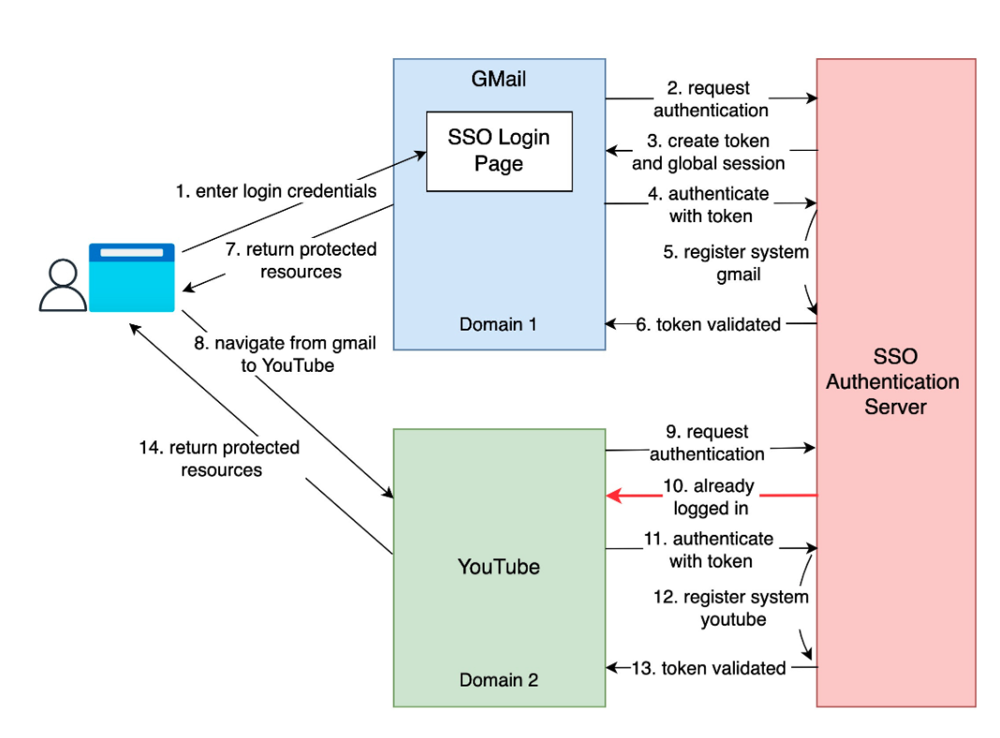

# [System Design] SSO

:::caution

This is not original content, but just a note from articles I read.

:::

## What is SSO (Single Sign-On)?

**Single Sign-On (SSO)** is an authentication scheme. It allows a user to log in to different systems using a single ID.

## Reference

+ @ [AlexXu](https://blog.bytebytego.com/p/what-is-sso-episode-7) - What is SSO (Episode 7) ?
