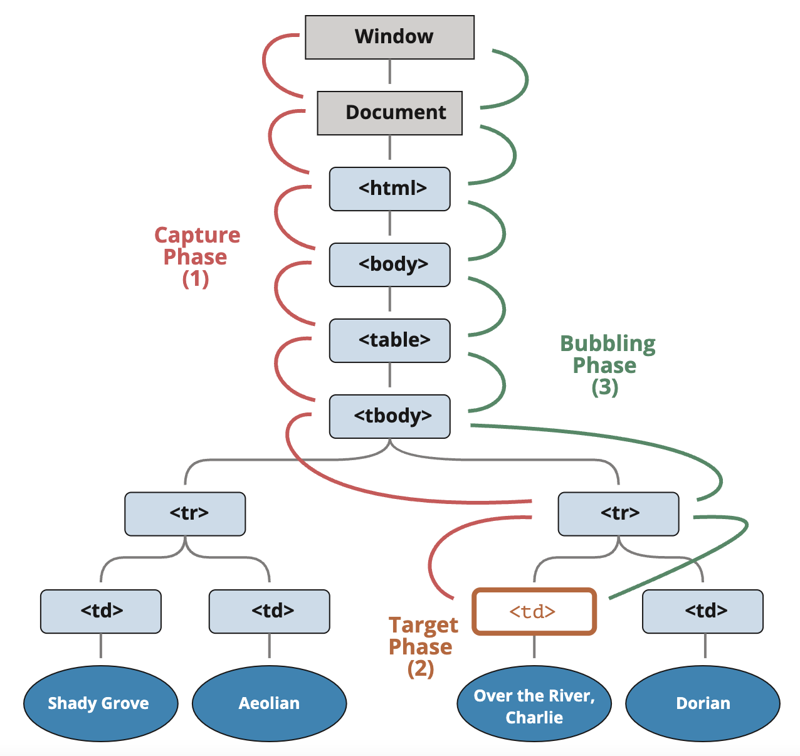
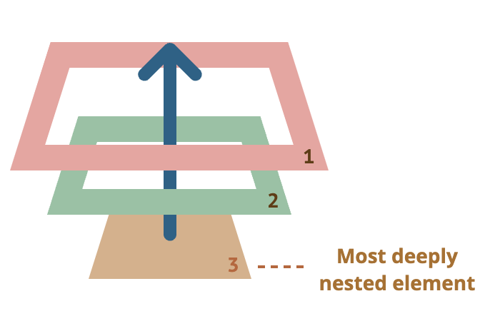

# [WebAPIs] Event Capturing and Bubbling

:::caution

This is not original content, but just a note from articles I read.

:::

## Capturing

There’s another phase of event processing called “capturing”. It is rarely used in real code, but sometimes can be useful.

The standard DOM Events describes 3 phases of event propagation:

1. Capturing phase – the event goes down to the element.
2. Target phase – the event reached the target element.
3. Bubbling phase – the event bubbles up from the element.



To catch an event on the **capturing phase**, we need to set the handler capture option to true:

```javascript
elem.addEventListener(..., {capture: true})

// or, just "true" is an alias to {capture: true}
elem.addEventListener(..., true)
```

## Event target

A handler on a parent element can always get the details about where it actually happened.

The most deeply nested element that caused the event is called a **target element**, accessible as **event.target**.

## Bubbling

When an event happens on an element, it first runs the handlers on it, then on its parent, then all the way up on other ancestors.

```html
<style>
  body * {
    margin: 10px;
    border: 1px solid blue;
  }
</style>

<form onclick="alert('form')">FORM
  <div onclick="alert('div')">DIV
    <p onclick="alert('p')">P</p>
  </div>
</form>
```

According to the definition of bubbling, we’ll see 3 alerts: p -> div -> from.

:::caution
**Almost all events bubble, except for focus.**
:::



### stop bubbling

Any handler may decide that the event has been fully processed and stop the bubbling.

The method for it is **event.stopPropagation()**.

For instance, here `body.onclick` doesn’t work if you click on `<button>`:

```html
<body onclick="alert(`the bubbling doesn't reach here`)">
  <button onclick="event.stopPropagation()">Click me</button>
</body>
```

:::info
If an element has multiple event handlers on a single event, then even if **one of them stops the bubbling**, **the other ones still execute**.

In other words, **event.stopPropagation()** stops the move upwards, but on the current element all other handlers will run.

To stop the bubbling and prevent handlers on the current element from running, there’s a method **event.stopImmediatePropagation()**. After it **no other handlers execute**.
:::

## Reference

+ @ [summer](https://www.cythilya.tw/2015/07/08/javascript-event-delegation/) - Event Delegation 事件委派
